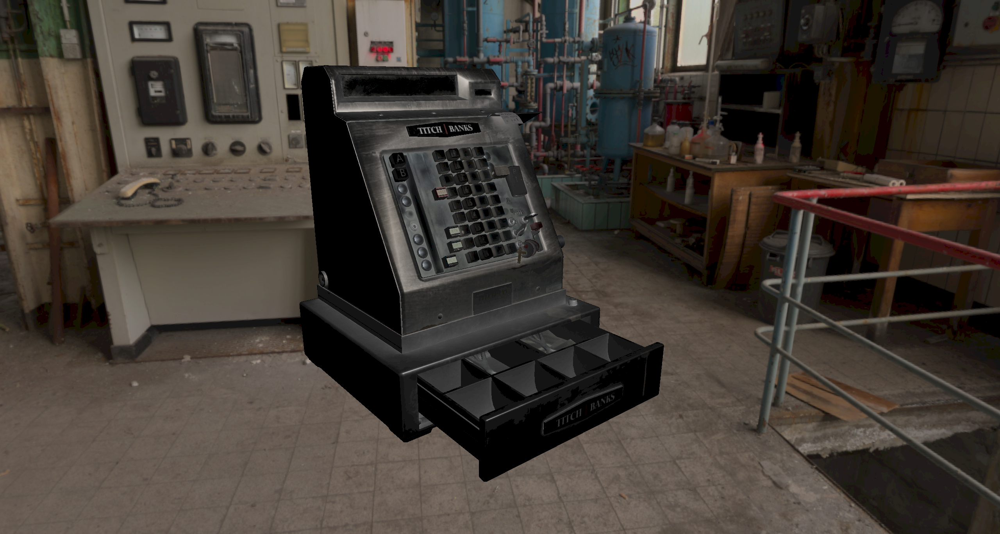
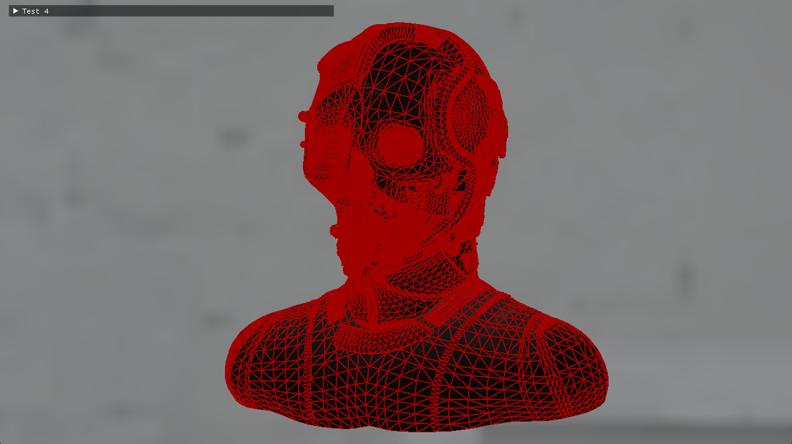

# RTRT

Various basic renderers 
=======================

Test3 : GPU Path tracer
--------

A (poorly lit) physically based path tracer written in c++ and GLSL.

Test4 : CPU Rasterizer
--------

Software rasterizer running on the CPU.
Basic phong reflecton model.

References/Credits
--------
- Path tracer largely inspired from GLSL-PathTracer (https://github.com/knightcrawler25/GLSL-PathTracer)
- Rasterizer also inspired from CPURasterizer (https://github.com/Zielon/CPURasterizer)
- Scratch a pixel courses (https://www.scratchapixel.com/)
